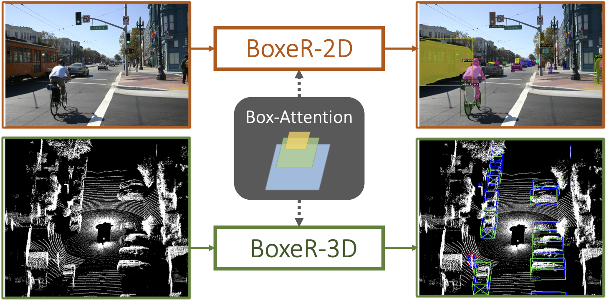
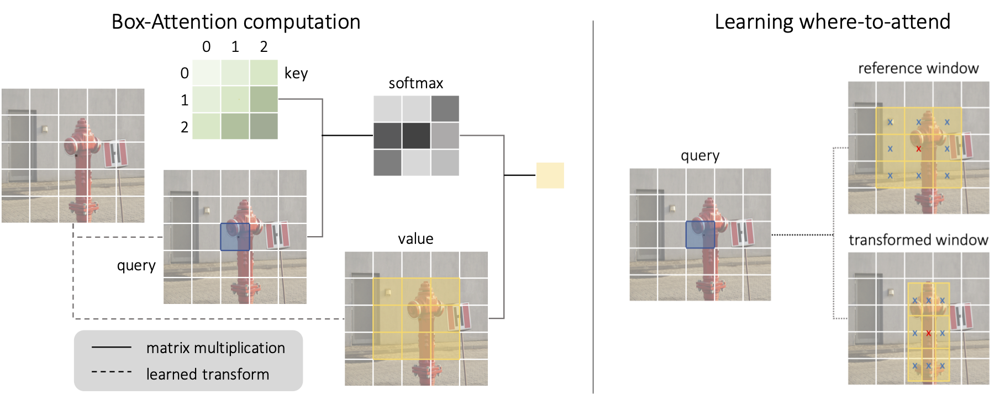

# BoxeR

By [Duy-Kien Nguyen](https://scholar.google.com/citations?user=welhhBIAAAAJ&hl=en), Jihong Ju, Olaf Booij, [Martin R. Oswald](https://scholar.google.de/citations?user=biytQP8AAAAJ&hl=en), [Cees Snoek](https://www.ceessnoek.info/).

This repository is an official implementation of the paper [BoxeR: Box-Attention for 2D and 3D Transformers](https://arxiv.org/abs/2111.13087).

## Introduction

**TL; DR.** BoxeR is a Transformer-based network for end-to-end 2D object detection and instance segmentation, along with 3D object detection. The core of the network is Box-Attention which predicts regions of interest to attend by learning the transformation (translation, scaling, and rotation) from reference windows, yielding competitive performance on several vision tasks.





**Abstract.** In this paper, we propose a simple attention mechanism, we call box-attention. It enables spatial interaction between grid features, as sampled from boxes of interest, and improves the learning capability of transformers for several vision tasks. Specifically, we present BoxeR, short for Box Transformer, which attends to a set of boxes by predicting their transformation from a reference window on an input feature map. The BoxeR computes attention weights on these boxes by considering its grid structure. Notably, BoxeR-2D naturally reasons about box information within its attention module, making it suitable for end-to-end instance detection and segmentation tasks. By learning invariance to rotation in the box-attention module, BoxeR-3D is capable of generating discriminative information from a bird's-eye view plane for 3D end-to-end object detection. Our experiments demonstrate that the proposed BoxeR-2D achieves state-of-the-art results on COCO detection and instance segmentation. Besides, BoxeR-3D improves over the end-to-end 3D object detection baseline and already obtains a compelling performance for the vehicle category of Waymo Open, without any class-specific optimization.

## License

This project is released under the [MIT License](./LICENSE).


## Citing BoxeR
If you find BoxeR useful in your research, please consider citing:
```bibtex
@article{nguyen2021boxer,
  title={BoxeR: Box-Attention for 2D and 3D Transformers},
  author={Duy{-}Kien Nguyen and Jihong Ju and Olaf Booij and Martin R. Oswald and Cees G. M. Snoek},
  journal={arXiv preprint arXiv:2111.13087},
  year={2021}
}
```

## Main Results

### COCO Instance Segmentation Baselines with BoxeR-2D

<table><tbody>
<!-- START TABLE -->
<!-- TABLE HEADER -->
<th valign="bottom">Name</th>
<th valign="bottom">param<br/>(M)</th>
<th valign="bottom">infer<br/>time<br/>(fps)</th>
<th valign="bottom">box<br/>AP</th>
<th valign="bottom">box<br/>AP-S</th>
<th valign="bottom">box<br/>AP-M</th>
<th valign="bottom">box<br/>AP-L</th>
<th valign="bottom">segm<br/>AP</th>
<th valign="bottom">segm<br/>AP-S</th>
<th valign="bottom">segm<br/>AP-M</th>
<th valign="bottom">segm<br/>AP-L</th>
<!-- TABLE BODY -->
<!-- ROW: boxer2d_R_50_3x -->
 <tr><td align="left"><a href="e2edet/config/COCO-InstanceSegmentation/boxer2d_R_50_3x.yaml"> BoxeR-R50-3x</a></td>
<td align="center">40.1</td>
<td align="center">12.5</td>
<td align="center">50.3</td>
<td align="center">33.4</td>
<td align="center">53.3</td>
<td align="center">64.4</td>
<td align="center">42.9</td>
<td align="center">22.8</td>
<td align="center">46.1</td>
<td align="center">61.7</td>
</tr>
<!-- ROW: boxer2d_R_101_3x -->
 <tr><td align="left"><a href="e2edet/config/COCO-InstanceSegmentation/boxer2d_R_101_3x.yaml">BoxeR-R101-3x</a></td>
<td align="center">59.0</td>
<td align="center">10.0</td>
<td align="center">50.7</td>
<td align="center">33.4</td>
<td align="center">53.8</td>
<td align="center">65.7</td>
<td align="center">43.3</td>
<td align="center">23.5</td>
<td align="center">46.4</td>
<td align="center">62.5</td>
</tr>
<!-- ROW: boxer2d_R_101_5x_lsj -->
 <tr><td align="left"><a href="e2edet/config/COCO-InstanceSegmentation/boxer2d_R_101_5x_lsj.yaml">BoxeR-R101-5x</a></td>
<td align="center">59.0</td>
<td align="center">10.0</td>
<td align="center">51.9</td>
<td align="center">34.2</td>
<td align="center">55.8</td>
<td align="center">67.1</td>
<td align="center">44.3</td>
<td align="center">24.7</td>
<td align="center">48.0</td>
<td align="center">63.8</td>
</tr>
</tbody></table>

## Installation

### Requirements

* Linux, CUDA>=11, GCC>=5.4
  
* Python>=3.8

    We recommend you to use Anaconda to create a conda environment:
    ```bash
    conda create -n boxer python=3.8
    ```
    Then, activate the environment:
    ```bash
    conda activate boxer
    ```
  
* PyTorch>=1.10.1, torchvision>=0.11.2 (following instructions [here](https://pytorch.org/))

    For example, you could install pytorch and torchvision as following:
    ```bash
    conda install pytorch torchvision torchaudio cudatoolkit=11.3 -c pytorch
    ```
  
* Other requirements & Compilation
    ```bash
    python -m pip install -e BoxeR
    ```

	You can test the CUDA operators (box and instance attention) by running 
    ```bash
    python tests/box_attn_test.py
	python tests/instance_attn_test.py
    ```

## Usage

### Dataset preparation

The datasets are assumed to exist in a directory specified by the environment variable $E2E_DATASETS.
If the environment variable is not specified, it will be set to be ```.data```.
Under this directory, detectron2 will look for datasets in the structure described below.

```
$E2E_DATASETS/
├── coco/
└── waymo/
```

For COCO Detection and Instance Segmentation, please download [COCO 2017 dataset](https://cocodataset.org/) and organize them as following:

```
$E2E_DATASETS/
└── coco/
	├── annotation/
		├── instances_train2017.json
		├── instances_val2017.json
		└── image_info_test-dev2017.json
	├── image/
		├── train2017/
		├── val2017/
		└── test2017/
	└── vocabs/
		└── coco_categories.txt - the mapping from coco categories to indices.
```
The ```coco_categories.txt``` can be downloaded [here](https://drive.google.com/file/d/1AcLUxVRzF2m26tNaFrAsnOvX0Z5L9oSz/view?usp=sharing).

For Waymo Detection, please download [Waymo Open dataset](https://waymo.com/intl/en_us/open/) and organize them as following:

```
$E2E_DATASETS/
└── waymo/
	├── infos/
		├── dbinfos_train_1sweeps_withvelo.pkl
		├── infos_train_01sweeps_filter_zero_gt.pkl
		└── infos_val_01sweeps_filter_zero_gt.pkl
	└── lidars/
		├── gt_database_1sweeps_withvelo/
			├── CYCLIST/
			├── VEHICLE/
			└── PEDESTRIAN/
		├── train/
			├── annos/
			└── lidars/
		└── val/
			├── annos/
			└── lidars/
```
You can generate data files for our training and evaluation from raw data by running ```create_gt_database.py``` and ```create_imdb``` in ```tools/preprocess```.

### Training
Our script is able to automatically detect the number of available gpus on a single node.
It works best with Slurm system when it can auto-detect the number of available gpus along with nodes.
The command for training BoxeR is simple as following:

```bash
python tools/run.py --config ${CONFIG_PATH} --model ${MODEL_TYPE} --task ${TASK_TYPE}
```

For example,

* COCO Detection

```bash
python tools/run.py --config e2edet/config/COCO-Detection/boxer2d_R_50_3x.yaml --model boxer2d --task detection
```

* COCO Instance Segmentation

```bash
python tools/run.py --config e2edet/config/COCO-InstanceSegmentation/boxer2d_R_50_3x.yaml --model boxer2d --task detection
```

* Waymo Detection,

```bash
python tools/run.py --config e2edet/config/Waymo-Detection/boxer3d_pointpillar.yaml --model boxer3d --task detection3d
```

#### Some tips to speed-up training
* If your file system is slow to read images but your memory is huge, you may consider enabling 'cache_mode' option to load whole dataset into memory at the beginning of training:

```bash
python tools/run.py --config ${CONFIG_PATH} --model ${MODEL_TYPE} --task ${TASK_TYPE} dataset_config.${TASK_TYPE}.cache_mode=True
```

* If your GPU memory does not fit the batch size, you may consider to use 'iter_per_update' to perform gradient accumulation:

```bash
python tools/run.py --config ${CONFIG_PATH} --model ${MODEL_TYPE} --task ${TASK_TYPE} training.iter_per_update=2
```

* Our code also supports mixed precision training. It is recommended to use when you GPUs architecture can perform fast FP16 operations:

```bash
python tools/run.py --config ${CONFIG_PATH} --model ${MODEL_TYPE} --task ${TASK_TYPE} training.use_fp16=(float16 or bfloat16)
```

### Evaluation

You can get the config file and pretrained model of BoxeR, then run following command to evaluate it on COCO 2017 validation/test set:

```bash
python tools/run.py --config ${CONFIG_PATH} --model ${MODEL_TYPE} --task ${TASK_TYPE} training.run_type=(val or test or val_test)
```

For Waymo evaluation, you need to additionally run the script ```e2edet/evaluate/waymo_eval.py``` from the root folder to get the final result.


### Analysis and Visualization

You can get the statistics of BoxeR (fps, flops, \# parameters) by running ```tools/analyze.py``` from the root folder.

```bash
python tools/analyze.py --config-path save/COCO-InstanceSegmentation/boxer2d_R_101_3x.yaml --model-path save/COCO-InstanceSegmentation/boxer2d_final.pth --tasks speed flop parameter
```

The notebook for BoxeR-2D visualization is provided in ```tools/visualization/BoxeR_2d_segmentation.ipynb```.